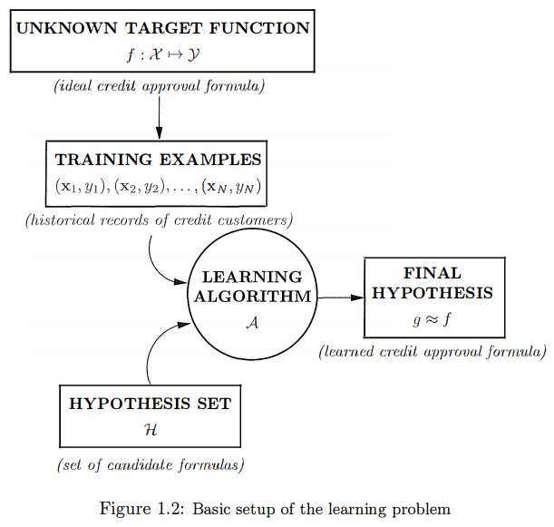

# The learning problem

## Problem Setup 

Learning from data is used in situations where we don't have an analytic solution, but we do have data that we can use to construct an empirical solution.

There is the input $\bold x$, the unknown target function $f: \mathcal{X}\to\mathcal{Y}$, where $\mathcal{X}$ is the input space and $\mathcal{Y}$ is the output space. There is a data set $\mathcal{D}$ of input-output examples $(x_1, y_1), ..., (x_N, y_N)$ where $y_n=f(x_n)$ for $n=1,...,N$. Finally, there is the learning algorithm that uses the data set $\mathcal{D}$ to pick a formula $g:  \mathcal{X}\to\mathcal{Y}$ that approximates $f$. The algorithm chooses $g$ from a set of candidate formulas under consideration, which we call the hypothesis set $ \mathcal{H}$. The hypothesis set and learning algorithm are referred to informally as the learning model.

### Types of learning
- [Supervised Learning](https://en.wikipedia.org/wiki/Supervised_learning): When the training data contains explicit examples of what the correct output should be for given inputs, then we are within the supervised learning setting that we have covered so far. 

  - [active learning](https://en.wikipedia.org/wiki/Active_learning_(machine_learning)): the data set is acquired through queries that we make. The learning algorithm is able to interactively query the user (or some other information source) to obtain the desired outputs at new data points.
  - [online learning](https://en.wikipedia.org/wiki/Online_machine_learning): the data set is given to the algorithm one example at a time. This happens when we have streaming data that the algorithm has to process 'on the run'. 

- Reinforcement Learning

  the training example does not contain the target output, but instead contains some possible output together with a measure of how good that output is. The reinforcement learning algorithm is left with the task of sorting out the information coming from different examples to find the best line of play. 

- Unsupervised Learning

  Unsupervised learning can be viewed as the task of spontaneously finding patterns and structure in input data and also can be viewed as a way to create a higher-level representation of the data.
## Is Learning Feasible
Hoeffding Inequality:
$$
\Bbb{P}[|E_{in}(g)-E_{out}(g)|>\varepsilon]\le2Me^{-2\varepsilon^{2}N} \  for\ any\ \varepsilon \gt0
$$
The feasibility of learning is split into two questions:

- Can we make sure that $E_{out}(g)$  is close enough to $E_{in}(g)​$?
- Can we make $E_{in}(g)$ small enough?

# Training versus Testing

## Theory of Generalization
## Interpreting the Generalization Bound
## Approximation-Generalization Tradeoff
# The Linear Model

# Overfitting

# Three Learning Principles

